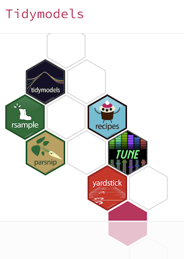

```{r setup, include=FALSE}
knitr::opts_chunk$set(echo = TRUE)
library(tidymodels)
library(readr)
library(broom)
library(broom.mixed)
library(skimr)
library(remotes)
library(dplyr)
library(magrittr)
library(parallel)
library(doParallel)
library(vip)
library(themis)
library(plotly)
```




# Starting out with TidyModels

TidyModels is the newer version of Max Kuhn's CARET and can be used for a number of machine learning tasks. This modelling framework takes a different approach to modelling - allowing for a more structured workflow, and like tidyverse, has a whole set of packages for making the machine learning process easier. I will touch on a number of these packages in the following sub sections. 

This package supercedes that in R for Data Science, as Hadley Wickham admitted he needed a better modelling solution at the time, and Max Kuhn and team have delivered on this. 

The aim of this webinar is to:

- Teach you the steps to build an ML model from scratch
- Work with rsample and recipes for feature engineering
- Train and build a workflow with Parsnip
- Evaluate your model with Yardstick and CARET
- Improve your model with Tune and Dials

The framework of a TidyModels approach flows as so:


I will show you the steps in the following tutorials.

# Step one - Importing data into the R environment

I will load in the stranded patient data - a stranded patient is a patient that has been in hospital for longer than 7 days and we also call these <strong>Long Waiters</strong>. The import steps are below and use the native readr package to load this in:


```{r load_in}
# Read in the data
strand_pat <- read_csv("Data/Stranded_Data.csv") %>% 
  setNames(c("stranded_class", "age", "care_home_ref_flag", "medically_safe_flag", 
             "hcop_flag", "needs_mental_health_support_flag", "previous_care_in_last_12_month", "admit_date", "frail_descrip")) %>% 
  mutate(stranded_class = factor(stranded_class)) %>% 
  drop_na()

print(head(strand_pat))

```

As this is a classification problem we need to look at the classification imbalance in the predictor variable i.e. the thing we are trying to predict. 

# Step Two - Analysing the Class Imbalance

The following code looks at the class imbalance as a volume and proportion and then I am going to use the second index from the class balance table i.e. the number of people who are long waiters is going to be lower than those that aren't, otherwise we are offering a very poor service to patients. 

```{r class_imbalance}
class_bal_table <- table(strand_pat$stranded_class)
prop_tab <- prop.table(class_bal_table)
upsample_ratio <- class_bal_table[2] / sum(class_bal_table)
print(prop_tab)
print(class_bal_table)
print(upsample_ratio)


```

# Step Three - Observe data structures

It is always a good idea to observe the data structures of the data items we are trying to predict. I generally separate the names of the variables out into factors, integer / numerics and character vectors:

```{r sep_data}
strand_pat$admit_date <- as.Date(strand_pat$admit_date, format="%d/%m/%Y") #Format date to be date to work with recipes steps
factors <- names(select_if(strand_pat, is.factor))
numbers <- names(select_if(strand_pat, is.numeric))
characters <- names(select_if(strand_pat, is.character))
print(factors); print(numbers); print(characters)


```

# Step Four - Using Rsample to create ML data partitions

The Rsample package makes it easy to divide your data up. To view all the functionality navigate to the [Rsample](https://rsample.tidymodels.org/) vignette.

We will divide the data into a training and test sample. This approach is the simplest method to testing your models accuracy and future performance on unseen data. Here we are going to treat the test data as the unseen data to allow us to evaluate if the model is fit for being released into the wild, or not. 

```{r dividing_data}
# Partition into training and hold out test / validation sample
set.seed(123)
split <- rsample::initial_split(strand_pat, prop=3/4)
train_data <- rsample::training(split)
test_data <- rsample::testing(split)

```

# Step Five - Creating your first Tidy Recipe

Recipes is an excellent package. I have for years done feature, dummy and other types of coding and feature selection with CARET, also a great package, but this makes the process much simpiler. The first part of the recipe is to fit your model and then you add recipe steps, this is supposed to replicate baking adding the specific ingredients. For all the particular steps that recipes contains, go directly to the [recipes](https://recipes.tidymodels.org/reference/index.html) site. 

```{r prep_the_recipe}
stranded_rec <- 
  recipe(stranded_class ~ ., data=train_data) %>% 
  # The stranded class is what we are trying to predict and we are using the training data
  step_date(admit_date, features = c("dow", "month")) %>% 
  #Recipes step_date allows for additional features to be created from the date 
  step_rm(admit_date) %>% 
  #Remove the date, as we have created features off of it, if left in the dreaded multicolinearity may be present
  themis::step_upsample(stranded_class, over_ratio = as.numeric(upsample_ratio)) %>%  
  #SMOTE recipe step to upsample the minority class i.e. stranded patients
  step_dummy(all_nominal(), -all_outcomes()) %>% 
  #Automatically created dummy variables for all categorical variables (nominal)
  step_zv(all_predictors()) %>% 
  #Get rid of features that have zero variance
  step_normalize(all_predictors()) #ML models train better when the data is centered and scaled

print(stranded_rec) #Terminology is to use recipe

```

To look up some of these steps, I have previously covered them in a [CARET tutorial](https://www.youtube.com/watch?v=rO40vvKXU-4&t=1216s). For all the list of recipes steps refer to the link above the code chunk. 

# Step Six - Get Parsnipping

The package [Parsnip](https://parsnip.tidymodels.org/articles/articles/Models.html) is the model to work with TidyModels. Parsnip still does not have many of the algorithms present in CARET, but it makes it much simpler to work in the tidy way. 

Here we will create a basic logistic regression as our baseline model. If you want a second tutorial around model ensembling in TidyModels with Baguette and Stacks, then I would be happy to arrange this, but these are a session in themselves. 

The reason Logistic Regression is the choice as it is a nice generalised linear model that most people have encountered. 

TidyModels has a workflow structure which we will build in the next few steps:

## Instantiate the model

In TidyModels you have to create an instance of the model in memory before working with it:

```{r instantiatemodel}

lr_mod <- 
  parsnip::logistic_reg() %>% 
  set_engine("glm")

print(lr_mod)

```

The next step is to create the model workflow.

## Creating the model workflow

Now it is time to do the workflow to connect the newly instantiated model together:
```{r createwf}
# Create model workflow
strand_wf <- 
  workflow() %>% 
  add_model(lr_mod) %>% 
  add_recipe(stranded_rec)

print(strand_wf)

```

## Fitting the workflow to our data

The next step is fitting the model to our data:
```{r strand_fit_model}
# Create the model fit
strand_fit <- 
  strand_wf %>% 
  fit(data = train_data)


```

## Extracting the fitted data

The final step is to use the pull_workflow_fit() parameter to retrieve the fit on the workflow:
```{r extract_fit}
strand_fitted <- strand_fit %>% 
  pull_workflow_fit() %>% 
  tidy()

print(strand_fitted)

```
## Create custom plot to visualise significance utilising p values

As an optional step I have created a plot to visualise the significance. This will only work with linear, and generalized linear models, that analyse p values from t tests and finding the probability value from the t distribution. The visualisation code is contained hereunder: 
```{r significancevisualisation}
# Add significance column to tibble using mutate
strand_fitted <- strand_fitted  %>% 
  mutate(Significance = ifelse(p.value < 0.05, "Significant", "Insignificant")) %>% 
  arrange(desc(p.value)) 

#Create a ggplot object to visualise significance
plot <- strand_fitted %>% 
  ggplot(data = strand_fitted, mapping = aes(x=term, y=p.value, fill=Significance)) +
  geom_col() + theme(axis.text.x = element_text(
                                        face="bold", color="#0070BA", 
                                        size=8, angle=90)
                                                ) + labs(y="P value", x="Terms", 
                                                         title="P value significance chart",
                                                         subtitle="A chart to represent the significant variables in the model",
                                                         caption="Produced by Gary Hutson")

#print("Creating plot of P values")
#print(plot)
plotly::ggplotly(plot)
#print(ggplotly(plot))
#ggsave("Figures/p_val_plot.png", plot) #Save the plot

```

# Step Seven - Predicting with the holdout (test) dataset

Now we will assess how well the model predicts on the test (holdout) data to evaluate if we want to productionise the model, or abandon it at this stage. This is implemented below:

```{r preds}
class_pred <- predict(strand_fit, test_data) #Get the class label predictions
prob_pred <- predict(strand_fit, test_data, type="prob") #Get the probability predictions
lr_predictions <- data.frame(class_pred, prob_pred) %>% 
  setNames(c("LR_Class", "LR_NotStrandedProb", "LR_StrandedProb")) #Combined into tibble and rename

stranded_preds <- test_data %>% 
  bind_cols(lr_predictions)

print(tail(lr_predictions))
```

# Step Eight - Evaluate the model fit with Yardstick and CARET (Confusion Matrices)

[Yardstick](https://yardstick.tidymodels.org/) is another tool in the TidyModels arsenal. It is useful for generating quick summary statistics and evaluation metrics. I will grab the area under the curve estimates to show how well the model fits:
```{r roc}
roc_plot <- 
  stranded_preds %>% 
  roc_curve(truth = stranded_class, LR_NotStrandedProb) %>% 
  autoplot

print(roc_plot)

stranded_preds %>% 
  roc_auc(truth = stranded_class, LR_NotStrandedProb)
# Get area under the curve value - accuracy


```


I like ROC plots - but they only show you sensitivity how well it is at predicting stranded and the inverse how good it is at predicting not stranded. I like to look at the overall accuracy and balanced accuracy on a confusion matrix, for binomial classification problems. 

I use the CARET package and utilise the confusion matrix functions to perform this:

```{r cm}
library(caret)
cm <- caret::confusionMatrix(stranded_preds$stranded_class,
                       stranded_preds$LR_Class, 
                       positive="Stranded")

print(cm)
```

## Using ConfusionTableR package to visualise and flatten confusion matrix results

 <!--align="right">-->

On the back of the Advanced Modelling course I did for the NHS-R Community I have created a package to work with the outputs of a confusion matrix. This package is aimed at the flattening of binary and multi-class confusion matrix results. 

To load in the package you need to use the remotes package and bring in the ConfusionTableR package, which is available from my [GitHub](https://github.com/StatsGary/ConfusionTableR) site.
```{r cm_visual}
#Load in my ConfusionTableR package to visualise this
#remotes::install_github("https://github.com/StatsGary/ConfusionTableR") #Use remotes package to install the package 
#from GitHub r
library(ConfusionTableR)
cm_plot <- ConfusionTableR::binary_visualiseR(cm, class_label1 = "Not Stranded", 
                     class_label2 = "Stranded",
                     quadrant_col1 = "#53BFD3", quadrant_col2 = "#006838", 
                     text_col = "white", custom_title = "Stranded patient Confusion Matrix")

# Flatten to store in database
#Stored confusion matrix

cm_results <- ConfusionTableR::binary_class_cm(cm)
print(cm_results)

```

The next markdown document will look at how to improve your models with model selection, K-fold cross validation and hyperparameter tuning. I was thinking of doing an ensembling course off the back of this, so please contact me if that would be interesting to you.

# Save the data for consumption in the next tutorials

I will now save the R image data into file, as we will pick this up in the next markdown document.

```{r saveData}
save.image(file="Data/stranded_data.rdata")

```

# Resuming where we left off in the first Markdown document

The first markdown document showed you how to build your first TidyModels model on an healthcare dataset. This could be a ML model you simply tweak for your own uses. I will now load the data back in and resume where we left off:

```{r load_data}
load(file="Data/stranded_data.rdata")

```


# Improve the model with resampling with the Rsample package

The first step will involve something called cross validation (see supporting workshop slides). The essence of cross validation is that you take sub samples of the training dataset. This is done to emulate how well the model will perform on unseen data samples when out in the wild (production):


As the image shows - the folds take a sampe of the training set and each randomly selected fold acts as the test sample. We then use a final hold out validation set to finally test the model. This will be shown in the following section. 

```{r kfold}
set.seed(123)
#Set a random seed for replication of results
ten_fold <- vfold_cv(train_data, v=10)

```

## Use previous workflow with cross validation

We will use the previous trained logistic regression model with resamples to improve the results of the cross validation:
```{r resamples_on_log_mod}
set.seed(123)
lr_fit_rs <- 
  strand_wf %>% 
  fit_resamples(ten_fold)

```


We will now collect the metrics using the tune package and the collect_metrics function:

```{r resamples_collmets}
# To collect the resmaples you need to call collect_metrics to average out the accuracy for that model
collected_mets <- tune::collect_metrics(lr_fit_rs)
print(collected_mets)
# Now I can compare the accuracy from the previous test set I had already generated a confusion matrix for
accuracy_resamples <- collected_mets$mean[1] * 100
accuracy_validation_set <- as.numeric(cm$overall[1] * 100)
print(cat(paste0("The true accuracy of the model is between the resample testing:", 
            round(accuracy_resamples,2), "\nThe validation sample: ",
            round(accuracy_validation_set,2), ".")))

```


This shows that the true accuracy value is somewhere between the reported results from the resampling method and those in our validation sample. 

# Improve the model with different model selection and resampling

The following example will move on from the logistic regression and aim to build a random forest, and later a decision tree. Other options in Parnsip would be to use a gradient boosted tree to amp up the results further. In addition, I aim at teaching a follow up webinar to this for ensembling - specifically model stacking (Stacks package) and bagging (Baguette package).

## Define and instantiate the model

The first step, as with the logistic regression example, if to define and instantiate the model:

```{r define_mod}
rf_mod <- 
  rand_forest(trees=500) %>% 
  set_engine("ranger") %>% 
  set_mode("classification")

print(rf_mod)
```

## Fit the model to the previous training data

Then we are going to fit the model to the previous training data:

```{r fit_model}
rf_fit <- 
  rf_mod %>% 
  fit(stranded_class ~ ., data = train_data)

print(rf_fit)
```

## Improve further by fitting to resamples

We will aim to increase the sample representation in this model by fitting it to a resamples object, in parsnip and rsample:
```{r fit_model_rsampl}
#Create workflow step
rf_wf <- 
  workflow() %>% 
  add_model(rf_mod) %>% 
  add_formula(stranded_class ~ .) #The predictor is contained in add_formula method

set.seed(123)
rf_fit_rs <- 
  rf_wf %>% 
  fit_resamples(ten_fold)

print(rf_fit_rs)
```

## Collect the resampled metrics

The next step is to collect the resample metrics:

```{r fit_model_rsamples_preds}
# Collect the metrics using another model with resampling
rf_resample_mean_preds <- tune::collect_metrics(rf_fit_rs)
print(rf_resample_mean_preds)
```

The model predictive power is maxing out at about 78%. I know this is due to the fact that the data is dummy data and most of the features that are contained in the model have a weak association to the outcome variable. 

What you would need to do after this is look for more representative features of what causes a patient to stay a long time in hospital. This is where the clinical context comes into play.

# Improve the model with hyperparameter tuning with the Dials package

We are going to now create a decision tree and we are going to tune the hyperparameters using the dials package. The dials package contains a list of hyperparameter tuning methods and is useful for creating quick hyperparameter grids and aiming to optimise them. 

## Building the decision tree

Like all the other steps, the first thing to do is build the decision tree. Note - the reason set_model("classification") is because the thing we are predicting is a factor. If this was a continuous variable, then you would need to switch this to regression. However, the model development for regression is identical to classification.

```{r build_decision_tree}
tune_tree <- 
  decision_tree(
    cost_complexity = tune(), #tune() is a placeholder for an empty grid 
    tree_depth = tune() #we will fill these in the next section
  ) %>% 
  set_engine("rpart") %>% 
  set_mode("classification")

print(tune_tree)
```

## Create the hyperparameter grid search

The next step is to fill these blank values for cost complexity and tree depth - see the documentation for parsnip about these meaning, but decision trees have a cost value which minimises the splits and the depth of the tree is how far down you go. 

We will now create the object:

```{r build_tuning}
grid_tree_tune <- grid_regular(dials::cost_complexity(),
                               dials::tree_depth(), 
                               levels = 10)
print(head(grid_tree_tune,20))
```

## Setting up parallel processing

The tuning process, and modelling process, normally needs the ML engineer to access the full potential of your machine. The next steps show how to register the cores on your machine and max them out for training the model and doing grid searching:
```{r parallelproc}
all_cores <- parallel::detectCores(logical = FALSE)-1
print(all_cores)
#Registers all cores and subtracts one, so you have some time to work
cl <- makePSOCKcluster(all_cores)
print(cl)
#Makes an in memory cluster to utilise your cores
registerDoParallel(cl)
#Registers that we want to do parallel processing
```


## Creating the model workflow

Next, I will create the model workflow, as we have done a few times before:
```{r parallelproc2}
set.seed(123)
tree_wf <- workflow() %>% 
  add_model(tune_tree) %>% 
  add_formula(stranded_class ~ .)
# Make the decision tree workflow - always postfix with wf for convention
# Add the registered model
# Add the formula of the outcome class you are predicting against all IVs

tree_pred_tuned <- 
  tree_wf %>% 
  tune::tune_grid(
    resamples = ten_fold, #This is the 10 fold cross validation variable we created earlier
    grid = grid_tree_tune #This is the tuning grid
  )

```

## Visualise the tuning process

This ggplot helps to visualise how the manual tuning has gone on and will show where the best tree depth occurs in terms of the cost complexity (the number of terminal or leaf nodes):

```{r tune_visual}
tune_plot <- tree_pred_tuned %>%
  collect_metrics() %>% #Collect metrics from tuning
  mutate(tree_depth = factor(tree_depth)) %>%
  ggplot(aes(cost_complexity, mean, color = tree_depth)) +
  geom_line(size = 1, alpha = 0.7) +
  geom_point(size = 1.5) +
  facet_wrap(~ .metric, scales = "free", nrow = 2) +
  scale_x_log10(labels = scales::label_number()) +
  scale_color_viridis_d(option = "plasma", begin = .9, end = 0) + theme_minimal()

print(tune_plot)
ggsave(filename="Figures/hyperparameter_tree.png", tune_plot)

```


This shows that you only need a depth of 4 to get the optimal accuracy. However, the tune package helps us out with this as well. 

## Selecting the best model from the tuning process with Tune

The tune package allows us to select the best candidate model, with the most optimal set of hyperparameters:


```{r tune_best}
# To get the best ROC - area under the curve value we will use the following:
tree_pred_tuned %>% 
  tune::show_best("roc_auc")

# Select the best tree
best_tree <- tree_pred_tuned %>% 
  tune::select_best("roc_auc")

print(best_tree)

```

The next step is to us the best tree to make our predictions.

## Using best tree to make predictions

```{r tune_best_select}
final_wf <- 
  tree_wf %>% 
  finalize_workflow(best_tree) #Finalise workflow passes in our best tree

print(final_wf)

```

Make a prediction against this finalised tree:

```{r tune_best_selected}
final_tree_pred <- 
  final_wf %>% 
  fit(data = train_data)

print(final_tree_pred)

```

## Use VIP package to visualise variable importance

We will look at global variable importance. As mentioned prior, to look at local patient level importance, use the [LIME package](https://cran.r-project.org/web/packages/lime/lime.pdf).

```{r wf_fit}
plot <- final_tree_pred %>% 
  pull_workflow_fit() %>% 
  vip(aesthetics = list(color = "black", fill = "#26ACB5")) + theme_minimal()

print(plot)
ggsave("Figures/VarImp.png", plot)

```

This was derived when we looked at the logistic regression significance that these would be the important variables, due to their linear significance. 

## Create the final predictions

The last step is to create the final predictions from the tuned decision tree:

```{r final_fitted}
# Create the final prediction
final_fit <- 
  final_wf %>% 
  last_fit(split)

final_fit_fitted_metrics <- final_fit %>% 
  collect_metrics() 

print(final_fit_fitted_metrics)

#Create the final predictions
final_fit_predictions <- final_fit %>% 
  collect_predictions()
print(final_fit_predictions)


```

## Visualise the final fit on a ROC curve

You could do similar with viewing this object in the confusion matrix add in, but I will view this on a plot:

```{r final_fit}
roc_plot <- final_fit_predictions %>% 
  roc_curve(stranded_class, `.pred_Not Stranded`) %>% 
  autoplot() 

print(roc_plot)
ggsave(filename = "Figures/tuned_tree.png", plot=roc_plot)

```

# Inspecting any Parsnip object

One last point to note - to inspect any of the tuning parameters and hyperparameters for the models you can use the args function to return these - examples below:

```{r parsnip_objects}
args(decision_tree)
args(logistic_reg)
args(rand_forest)

```

# Ensembling

The next section shows how to use the stacks package to ensemble our decision tree, logistic regression and random forest together. This uses the [stacks package](https://stacks.tidymodels.org/articles/basics.html).

## Create the models

We will use the recipe created for the first model we created for the models. The next step is to initialise the models. 

```{r models}

lr_model <- logistic_reg() %>% 
  set_mode("classification") %>% 
  set_engine("glm")

rf_model <- rand_forest() %>% 
  set_mode("classification") %>% 
  set_engine("ranger")

xg_boost_model <- boost_tree() %>% 
  set_mode("classification") %>% 
  set_engine("xgboost")

nn_model <- mlp(epochs=300, hidden_units = 5, dropout = 0.5) %>% 
  set_mode("classification") %>% 
  set_engine("keras", verbose=0)

neighbour_model <- nearest_neighbor() %>% 
  set_engine("kknn") %>% 
  set_mode("classification")

# You could tune hyperparameters here, see previous step, for simplicity I am 
# just instantiating the models

```

## Define the model workflows

Each of the models we have created will need its own worflow, so we will create one for each. The general rule in parsnip is for every model, create its own workflow. 

```{r workflows_stacks}

lr_wf <- workflow() %>% 
  add_model(lr_model) %>% 
  add_recipe(stranded_rec) #Use the stranded recipe we created once at the top

rf_wf <- workflow() %>% 
  add_model(rf_model) %>% 
  add_recipe(stranded_rec)

xgboost_wf <- workflow() %>% 
  add_model(xg_boost_model) %>% 
  add_recipe(stranded_rec)

nn_wf <- workflow() %>% 
  add_model(nn_model) %>% 
  add_recipe(stranded_rec)

neighbour_wf <- workflow() %>% 
  add_model(neighbour_model) %>% 
  add_recipe(stranded_rec)

print(lr_wf)
print(rf_wf)
print(xgboost_wf)
print(nn_wf)
print(neighbour_wf)

```

## Fit the models using K-Fold Cross Validation

We will now fit our 3 candidates models using resampling, as this is the defacto ML method for better representation in the underlying training data:

```{r fit_resamples_stacks}

model_control <- control_grid(save_pred = TRUE, save_workflow = TRUE)
registerDoParallel(cl)
#Register cluster for parallel processing

system.time(lr_fit <- fit_resamples(
  lr_wf,
  resamples = ten_fold,
  control = model_control
))


system.time(rf_fit <- fit_resamples(
  rf_wf,
  resamples = ten_fold,
  control = model_control
))

system.time(xgboost_fit <- fit_resamples(
  xgboost_wf,
  resamples = ten_fold,
   control = model_control
))

system.time(nn_fit <- fit_resamples(
  nn_wf, 
  resamples = ten_fold, 
  control = model_control
))

system.time(neighbours_fit <- fit_resamples(
  neighbour_wf, 
  resamples = ten_fold, 
  control = model_control
))

```

## Create a stacking ensemble

We will now load the stacks package to create a meta model of the decision tree, random forest and logistic regression classifiers. 

```{r stacking}

library(stacks)
meta_stacked_model <- stacks() %>% 
  add_candidates(lr_fit) %>% 
  add_candidates(rf_fit) %>% 
  add_candidates(xgboost_fit) %>% 
  add_candidates(nn_fit) %>% 
  add_candidates(neighbours_fit)

print(meta_stacked_model)

```
## The stacks model as a tibble
Really, the stacks model is a fancy tibble. To view it as such, use the casting function to convert to a tibble:

```{r stacks_tibble}
as_tibble(meta_stacked_model)

```
This shows that it generates probability predictions for the outcome variable, by each model type. 

##Blending prediction
This stacks the model, now we will blend the predictions from the models to use in our meta model:
```{r stacking_blend}
meta_stacked_model <- meta_stacked_model %>% 
  blend_predictions()
print(meta_stacked_model)


```

The blend_predictions function determines how member model output will ultimately be combined in the final prediction by fitting a LASSO model on the data stack, predicting the true assessment set outcome using the predictions from each of the candidate members. Candidates with nonzero stacking coefficients become members.

Now, we will use autoplot on this to look at the trade-off between minimising the number of members, whilst optimising performance:

```{r optim_performance}
theme_set(theme_minimal())
autoplot(meta_stacked_model)
autoplot(meta_stacked_model, type="members")
autoplot(meta_stacked_model, type="weights")
```
## Fitting candidate models into a stack

Once we have analysed the diagnostics, and viewed the accuracy and roc, we can then use the fit_members() function to fit our candidate models:

```{r meta_stacked_membs}
registerDoParallel(cl)
#Register cluster for parallel processing
system.time(meta_stacked_model <- meta_stacked_model %>% 
  fit_members())

print(meta_stacked_model)

```
Model stacks can be thought of as a group of fitted member models and a set of instructions on how to combine their predictions.

## Using stacked model to predict test data

The next stage is to make the predictions on the test hold out set, as we have used resampling to generate different samples on the training data:

```{r stacked_model}

test_data <- 
  test_data %>% 
  bind_cols(predict(meta_stacked_model, .),
            predict(meta_stacked_model, ., type="prob")) #Expose the prediction probabilities

print(test_data)

```

To visualise the distribution of ensemble model predictions vs actual stranded labels we will visualise this on a scatter chart:

## Assess meta model with confusion matrix

We will now assess the hold out sample with the confusion matrix:

```{r confu_mat_stacks}
cm <- caret::confusionMatrix(test_data$stranded_class,
                       test_data$.pred_class, 
                       positive="Stranded")

print(cm)
```

The ensemble performs well, especially in terms of sensitivitiy to predicting the stranded class, however I think class imbalance in this dataset would need to be adjusted further. 

Visualising this using the ConfusionTableR package:

```{r binary_visual}
cm_plot <- ConfusionTableR::binary_visualiseR(cm, class_label1 = "Not Stranded", 
                     class_label2 = "Stranded",
                     quadrant_col1 = "#53BFD3", quadrant_col2 = "#006838", 
                     text_col = "white", custom_title = "Stranded patient Confusion Matrix")


```

## Hyperparameter tuning 

The next phase of this would be to undertake hyperparameter tuning using dials, with the meta model to further improve the accuracy. I am sensing the best approach, however, would be to find more variables in the system th are indicative of a patient becoming stranded. 
