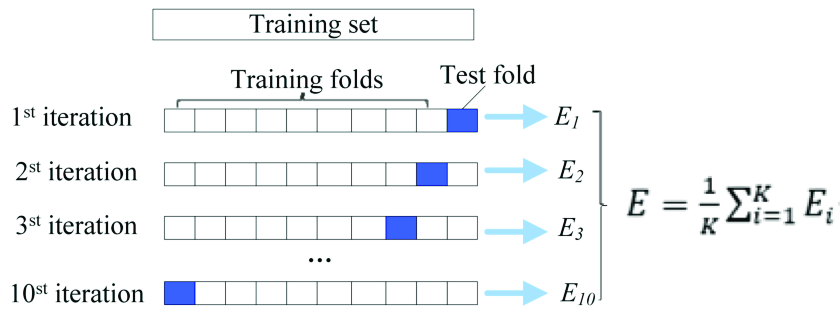

```{r setup, include=FALSE}
knitr::opts_chunk$set(echo = TRUE)
library(tidymodels)
library(readr)
library(broom)
library(broom.mixed)
library(skimr)
library(dplyr)
library(magrittr)
library(parallel)
library(doParallel)
library(vip)
```

# Resuming where we left off in the first Markdown document

The first markdown document showed you how to build your first TidyModels model on an healthcare dataset. This could be a ML model you simply tweak for your own uses. I will now load the data back in and resume where we left off:

```{r load_data}
load(file="Data/stranded_data.rdata")

```

# Improve the model with resampling with the Rsample package

The first step will involve something called cross validation (see supporting workshop slides). The essence of cross validation is that you take sub samples of the training dataset. This is done to emulate how well the model will perform on unseen data samples when out in the wild (production):


As the image shows - the folds take a sampe of the training set and each randomly selected fold acts as the test sample. We then use a final hold out validation set to finally test the model. This will be shown in the following section. 

```{r kfold}
set.seed(123)
#Set a random seed for replication of results
ten_fold <- vfold_cv(train_data, v=10)

```

## Use previous workflow with cross validation

We will use the previous trained logistic regression model with resamples to improve the results of the cross validation:
```{r resamples_on_log_mod}
set.seed(123)
lr_fit_rs <- 
  strand_wf %>% 
  fit_resamples(ten_fold)

```

We will now collect the metrics using the tune package and the collect_metrics function:

```{r resamples_collmets}
# To collect the resmaples you need to call collect_metrics to average out the accuracy for that model
collected_mets <- tune::collect_metrics(lr_fit_rs)
print(collected_mets)
# Now I can compare the accuracy from the previous test set I had already generated a confusion matrix for
accuracy_resamples <- collected_mets$mean[1] * 100
accuracy_validation_set <- as.numeric(cm$overall[1] * 100)
print(cat(paste0("The true accuracy of the model is between the resample testing:", 
            round(accuracy_resamples,2), "\nThe validation sample: ",
            round(accuracy_validation_set,2), ".")))

```

This shows that the true accuracy value is somewhere between the reported results from the resampling method and those in our validation sample. 

# Improve the model with different model selection and resampling

The following example will move on from the logistic regression and aim to build a random forest, and later a decision tree. Other options in Parnsip would be to use a gradient boosted tree to amp up the results further. In addition, I aim at teaching a follow up webinar to this for ensembling - specifically model stacking (Stacks package) and bagging (Baguette package).

## Define and instantiate the model

The first step, as with the logistic regression example, if to define and instantiate the model:

```{r define_mod}
rf_mod <- 
  rand_forest(trees=500) %>% 
  set_engine("ranger") %>% 
  set_mode("classification")

print(rf_mod)
```

## Fit the model to the previous training data

Then we are going to fit the model to the previous training data:

```{r fit_model}
rf_fit <- 
  rf_mod %>% 
  fit(stranded_class ~ ., data = train_data)

print(rf_fit)
```

## Improve further by fitting to resamples

We will aim to increase the sample representation in this model by fitting it to a resamples object, in parsnip and rsample:
```{r fit_model_rsampl}
#Create workflow step
rf_wf <- 
  workflow() %>% 
  add_model(rf_mod) %>% 
  add_formula(stranded_class ~ .) #The predictor is contained in add_formula method

set.seed(123)
rf_fit_rs <- 
  rf_wf %>% 
  fit_resamples(ten_fold)

print(rf_fit_rs)
```
## Collect the resampled metrics

The next step is to collect the resample metrics:

```{r fit_model_rsamples_preds}
# Collect the metrics using another model with resampling
rf_resample_mean_preds <- tune::collect_metrics(rf_fit_rs)
print(rf_resample_mean_preds)
```

The model predictive power is maxing out at about 78%. I know this is due to the fact that the data is dummy data and most of the features that are contained in the model have a weak association to the outcome variable. 

What you would need to do after this is look for more representative features of what causes a patient to stay a long time in hospital. This is where the clinical context comes into play.

# Improve the model with hyperparameter tuning with the Dials package

We are going to now create a decision tree and we are going to tune the hyperparameters using the dials package. The dials package contains a list of hyperparameter tuning methods and is useful for creating quick hyperparameter grids and aiming to optimise them. 

## Building the decision tree

Like all the other steps, the first thing to do is build the decision tree. Note - the reason set_model("classification") is because the thing we are predicting is a factor. If this was a continuous variable, then you would need to switch this to regression. However, the model development for regression is identical to classification.

```{r build_decision_tree}
tune_tree <- 
  decision_tree(
    cost_complexity = tune(), #tune() is a placeholder for an empty grid 
    tree_depth = tune() #we will fill these in the next section
  ) %>% 
  set_engine("rpart") %>% 
  set_mode("classification")

print(tune_tree)
```

## Create the hyperparameter grid search

The next step is to fill these blank values for cost complexity and tree depth - see the documentation for parsnip about these meaning, but decision trees have a cost value which minimises the splits and the depth of the tree is how far down you go. 

We will now create the object:

```{r build_tuning}
grid_tree_tune <- grid_regular(dials::cost_complexity(),
                               dials::tree_depth(), 
                               levels = 10)
print(head(grid_tree_tune,20))
```

## Setting up parallel processing

The tuning process, and modelling process, normally needs the ML engineer to access the full potential of your machine. The next steps show how to register the cores on your machine and max them out for training the model and doing grid searching:
```{r parallelproc}
all_cores <- parallel::detectCores(logical = FALSE)-1
#Registers all cores and subtracts one, so you have some time to work
cl <- makePSOCKcluster(all_cores)
#Makes an in memory cluster to utilise your cores
registerDoParallel(cl)
#Registers that we want to do parallel processing
```

## Creating the model workflow

Next, I will create the model workflow, as we have done a few times before:
```{r parallelproc}
set.seed(123)
tree_wf <- workflow() %>% 
  add_model(tune_tree) %>% 
  add_formula(stranded_class ~ .)
# Make the decision tree workflow - alway postfix with wf for convention
# Add the registered model
# Add the formula of the outcome class you are predicting against all IVs

tree_pred_tuned <- 
  tree_wf %>% 
  tune::tune_grid(
    resamples = ten_fold, 
    grid = grid_tree_tune
  )

print(tree_pred_tuned)
```

